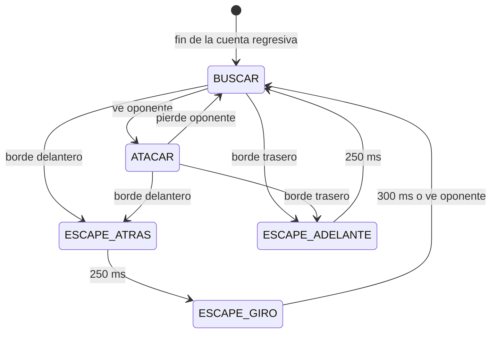

# Manual del Mini Sumo – ESP32

Manual de uso, conceptos y registros del firmware `MiniSumo_ESP32`.
Para cargar el código, ve al [README](README.md).

**Hardware:** ESP32 DevKit V1 · puente H L298N · 4 motores D20 (2 por lado, en paralelo) · 4 sensores de línea QRE1113 analógicos · sensor de oponente Sharp GP2Y0A21 · OLED 0.96" SSD1306 I2C · LiPo 2S 850 mAh · divisor de batería 10 kΩ / 4.7 kΩ.

---

## Contenido

1. [Conceptos](#1-conceptos)
2. [Registro de pines](#2-registro-de-pines)
3. [Registro de recursos del ESP32](#3-registro-de-recursos-del-esp32)
4. [Uso del robot](#4-uso-del-robot)
5. [Opciones del menú](#5-opciones-del-menú)
6. [Secuencia de pruebas recomendada](#6-secuencia-de-pruebas-recomendada)
7. [Lógica de combate](#7-lógica-de-combate)
8. [Parámetros ajustables (config.h)](#8-parámetros-ajustables-configh)
9. [Solución de problemas](#9-solución-de-problemas)
10. [Bitácora de pruebas](#10-bitácora-de-pruebas)

---

## 1. Conceptos

| Concepto | Qué es | Dónde aparece en el robot |
|---|---|---|
| **Dohyo** | La pista circular negra con un borde blanco. Sale perdiendo el robot que la abandona. | Los sensores de línea buscan ese borde blanco. |
| **Puente H** | Circuito que deja invertir el sentido de giro de un motor. El ESP32 no puede alimentar motores directamente. | L298N: un canal por lado del robot. |
| **IN1 / IN2** | Pines de dirección del puente H. `HIGH/LOW` = adelante, `LOW/HIGH` = atrás, `HIGH/HIGH` = freno. | Motores izquierdos: GPIO 26/27; derechos: 18/19. |
| **PWM** | Encender y apagar muy rápido para regular la potencia. El *duty* (0–255) es el porcentaje del tiempo encendido. | Pines ENA/ENB del L298N, a 1 kHz y 8 bits. |
| **Freno activo** | Las dos terminales del motor en cortocircuito: el motor se detiene de golpe en vez de girar libre. | `motor(lado, 0)` frena; no deja rodar. |
| **ADC** | Convertidor analógico-digital. Convierte un voltaje de 0–3.3 V en un número de 0 a 4095. | Sensores de línea, sensor IR y batería. |
| **ADC1 / ADC2** | El ESP32 tiene dos ADC. ADC2 deja de funcionar cuando se usa WiFi y da problemas, así que **todo lo analógico va en ADC1** (GPIO 32–39). | Ver [registro de pines](#2-registro-de-pines). |
| **Umbral** | Valor que separa "negro" de "blanco" (o "oponente" de "nada"). | Línea: uno por sensor, calibrado. IR: `UMBRAL_IR`. |
| **Calibración** | Medir el negro y el blanco del dohyo real y poner el umbral a la mitad. La luz y la altura cambian las lecturas. | Menú → *Calibrar linea*. |
| **QRE1113** | Sensor infrarrojo de reflexión. **Más reflejo (blanco) = voltaje más bajo.** | `BLANCO_ES_BAJO true`. |
| **Sharp GP2Y0A21** | Sensor de distancia por infrarrojo (10–80 cm). **Más cerca = voltaje más alto.** | Lectura mayor que `UMBRAL_IR` = oponente. |
| **Divisor de voltaje** | Dos resistencias que reducen un voltaje. La LiPo da hasta 8.4 V y el ESP32 solo aguanta 3.3 V en sus pines. | 10 kΩ + 4.7 kΩ → GPIO 33. |
| **LiPo 2S** | Batería de litio de 2 celdas en serie: 8.4 V cargada, 7.4 V nominal, ~6.8 V vacía. Por debajo de 3.0 V por celda se daña. | Indicador en la esquina de la pantalla. |
| **I2C** | Bus de 2 cables (SDA datos, SCL reloj) para conectar varios dispositivos. Cada uno tiene una dirección. | OLED en GPIO 21/22, dirección 0x3C. |
| **Máquina de estados** | El robot siempre está en un único "estado" (buscar, atacar, escapar…) y cambia de estado según los sensores. | Función `pelea()`, ver [sección 7](#7-lógica-de-combate). |
| **Pines de arranque (strapping)** | Pines que el ESP32 lee al encender para decidir cómo arrancar. Si se conectan mal, el ESP32 no arranca o entra en modo de programación. | GPIO 0, 2, 5, 12, 15. Solo se usan el 0 (BOOT) y el 2 (LED). |
| **NVS (Preferences)** | Memoria interna que no se borra al apagar. | Guarda los umbrales de línea calibrados. |
| **Rebote (debounce)** | Al presionar un botón, el contacto vibra unos milisegundos. Se ignoran las lecturas de los primeros 20 ms. | `leerBoton()`. |

---

## 2. Registro de pines

### Pines en uso

| GPIO | Función en el código | Dirección | Tipo | Conecta a | Notas |
|---|---|---|---|---|---|
| 0 | `PIN_BOTON` | Entrada (pull-up) | Digital | Botón **BOOT** de la placa | Pin de arranque: **no presionarlo al encender**. |
| 2 | `PIN_LED` | Salida | Digital | LED azul de la placa | Pin de arranque; como LED no causa problemas. |
| 13 | `PIN_DER_PWM` | Salida | PWM (LEDC) | L298N **ENB** | Quitar el jumper de ENB. |
| 18 | `PIN_DER_IN1` | Salida | Digital | L298N **IN3** | |
| 19 | `PIN_DER_IN2` | Salida | Digital | L298N **IN4** | |
| 21 | `PIN_SDA` | Bidireccional | I2C | OLED **SDA** | |
| 22 | `PIN_SCL` | Salida | I2C | OLED **SCL** | |
| 25 | `PIN_IZQ_PWM` | Salida | PWM (LEDC) | L298N **ENA** | Quitar el jumper de ENA. |
| 26 | `PIN_IZQ_IN1` | Salida | Digital | L298N **IN1** | |
| 27 | `PIN_IZQ_IN2` | Salida | Digital | L298N **IN2** | |
| 32 | `PIN_IR_OPONENTE` | Entrada | Analógica ADC1 | Sharp **Vo** (cable amarillo) | Salida máx. ~3.1 V: no necesita divisor. |
| 33 | `PIN_BATERIA` | Entrada | Analógica ADC1 | Punto medio del divisor 10k/4.7k | Máx. 2.7 V con la batería llena. |
| 34 | `PIN_LINEA_TRA_IZQ` | Entrada | Analógica ADC1 | QRE1113 trasero izquierdo **OUT** | Solo entrada, sin pull-up. |
| 35 | `PIN_LINEA_TRA_DER` | Entrada | Analógica ADC1 | QRE1113 trasero derecho **OUT** | Solo entrada, sin pull-up. |
| 36 (VP) | `PIN_LINEA_DEL_IZQ` | Entrada | Analógica ADC1 | QRE1113 delantero izquierdo **OUT** | Solo entrada. En la placa dice **VP**. |
| 39 (VN) | `PIN_LINEA_DEL_DER` | Entrada | Analógica ADC1 | QRE1113 delantero derecho **OUT** | Solo entrada. En la placa dice **VN**. |
| 23 | `PIN_STBY` | — | — | Sin uso con L298N | Reservado por si cambian a TB6612. |

### Alimentación

| De | A | Notas |
|---|---|---|
| LiPo 2S **+** | L298N **12V** | Con el jumper "5V-EN" del L298N puesto. |
| LiPo 2S **+** | Regulador step-down 5 V → ESP32 **VIN** | No alimentar el ESP32 desde el pin 5V del L298N con los motores frenando: el voltaje cae y el ESP32 se reinicia. |
| LiPo 2S **+** | Resistencia 10 kΩ → GPIO 33 → 4.7 kΩ → GND | Divisor de batería. |
| ESP32 **3V3** | QRE1113 (x4) VCC, OLED VCC | |
| ESP32 **VIN (5 V)** | Sharp VCC (cable rojo) | El Sharp necesita 5 V. |
| **GND** | Todos los GND (LiPo, L298N, ESP32, sensores, OLED) | **Una sola tierra común.** Sin ella nada funciona bien. |
| L298N **OUT1/OUT2** | Los 2 motores izquierdos, en paralelo | Si uno gira al revés que el otro, invierte sus cables. |
| L298N **OUT3/OUT4** | Los 2 motores derechos, en paralelo | |

### Pines libres para ampliaciones

| GPIO | Uso posible | Restricción |
|---|---|---|
| 4, 16, 17 | Botones, LEDs, sensores digitales | Ninguna. |
| 14 | Salida digital | Emite pulsos al arrancar: no conectar nada que se mueva. |
| 5, 15 | Salida digital | Pines de arranque: sin cargas que los fuercen al encender. |
| 12 | Evitar | Pin de arranque: si está en HIGH al encender, el ESP32 no arranca. |
| 6–11 | **No usar** | Conectados a la memoria flash interna. |
| 1, 3 | **No usar** | TX/RX del puerto USB (Monitor Serie). |

**ADC1 está completo:** 32, 33, 34, 35, 36 y 39 están ocupados. Un sensor analógico más tendría que ir en ADC2 (GPIO 4, 13, 14, 15, 25, 26, 27). Eso es posible porque no usamos WiFi, pero implicaría mover alguna salida.

---

## 3. Registro de recursos del ESP32

| Recurso | Uso | Configuración |
|---|---|---|
| **LEDC canal 0** | PWM de los motores izquierdos (GPIO 25) | 1 kHz, 8 bits (0–255) |
| **LEDC canal 1** | PWM de los motores derechos (GPIO 13) | 1 kHz, 8 bits (0–255) |
| **ADC1** | 4 sensores de línea, sensor IR y batería | 12 bits (0–4095), atenuación por defecto (0–3.3 V) |
| **I2C (Wire)** | OLED SSD1306 | 400 kHz, dirección 0x3C |
| **UART0 (Serial)** | Monitor Serie, opcional | 115200 baudios |
| **NVS** espacio `"sumo"` | Umbrales calibrados | Claves `u0` (DI), `u1` (DD), `u2` (TI), `u3` (TD) como `int` |

### Tiempos internos

| Qué | Valor | Dónde |
|---|---|---|
| Promedio de cada lectura de línea | 4 muestras | `leerLineaCruda()` |
| Promedio en calibración | 20 lecturas × 5 ms ≈ 100 ms por sensor | `promedioLinea()` |
| Lectura de batería | 16 muestras, como máximo cada 500 ms, con filtro 70/30 | `voltajeBateria()` |
| Rebote del botón | 20 ms | `leerBoton()` |
| Pulsación larga | > 600 ms | `T_PULSO_LARGO_MS` |
| Ciclo del bucle de pelea | ~2 ms + lecturas | `pelea()` |
| Refresco de pantalla en la prueba en conjunto | 150 ms (cada refresco bloquea ~25 ms) | `REFRESCO_PANTALLA_MS` |
| Refresco del menú (voltaje y parpadeo) | 400 ms | `loop()` |

---

## 4. Uso del robot

### El botón BOOT es el único control

| Acción | Resultado |
|---|---|
| **Pulsación corta** (< 0.6 s) | Pasa a la siguiente opción del menú (al llegar al final vuelve al inicio). |
| **Pulsación larga** (> 0.6 s) | Entra a la opción. La pantalla se invierte y el LED azul se enciende para indicar que ya cuenta como larga: **suelta el botón**. |
| **Cualquier pulsación dentro de una prueba** | Detiene la prueba y frena los motores. |

### Partes de la pantalla

```
┌────────────────────────────────┐
│ MINI SUMO          7.8V [███ ] │  ← título · voltaje · icono de batería
├────────────────────────────────┤
│ ╭────────────────────────────╮ █│  ← opción seleccionada (barra blanca)
│ │ COMBATE                    │ ┊│
│ ╰────────────────────────────╯ ┊│  ← barra de desplazamiento
│   Prueba en conjunto           ┊│
│   Motor izquierdo              ┊│
│· · · · · · · · · · · · · · · · │
│     corto: sig  largo: OK      │  ← ayuda de controles
└────────────────────────────────┘
```

- **Voltaje parpadeando:** batería por debajo de 7.0 V. Carga la LiPo.
- **"USB" en la esquina:** no hay lectura de batería (alimentado solo por USB o divisor desconectado).

### Encendido

1. Coloca el robot y enciéndelo **sin presionar BOOT**.
2. Aparece "MINI SUMO / ESP32" durante 1 s y luego el menú, con **COMBATE** ya seleccionado.

### En una competencia

1. Enciende el robot: el menú queda en **COMBATE**.
2. Cuando el juez lo indique, haz una **pulsación larga** y suelta.
3. La pantalla cuenta **5, 4, 3, 2, 1** (el LED parpadea). Aléjate del robot.
4. Aparece **"A PELEAR!"** y el robot empieza.
5. Para detenerlo, presiona BOOT. La pantalla muestra cuánto duró la pelea; otra pulsación regresa al menú.

### Con computadora (opcional)

Monitor Serie a 115200 baudios. Al enviar un número se ejecuta esa opción: `1` = COMBATE … `9` = Batería, y `0` frena los motores. Cada prueba imprime ahí sus lecturas con más detalle.

---

## 5. Opciones del menú

| # | Opción | Qué hace | Pantalla | Cómo termina |
|---|---|---|---|---|
| 1 | **COMBATE** | Espera 5 s y pelea a velocidad completa. | Cuenta regresiva y luego "A PELEAR!" (no se actualiza durante la pelea). | Una pulsación. |
| 2 | **Prueba en conjunto** | La misma lógica que COMBATE, al **50 %** de velocidad y con 3 s de espera. | El robot con sus sensores, el estado actual y el tiempo, en vivo. | Una pulsación. |
| 3 | **Motor izquierdo** | 2 s de aviso y luego: +120, +255, freno, −120, −255, freno (1.5 s cada uno). | Velocidad grande y ADELANTE / ATRAS / FRENO. | Termina sola o con una pulsación. |
| 4 | **Motor derecho** | Igual que la anterior, para el lado derecho. | Igual. | Igual. |
| 5 | **Movimientos** | Adelante, atrás, giro izq., giro der., arco izq., arco der. (1.2 s cada uno). | Nombre del movimiento. | Termina sola o con una pulsación. |
| 6 | **Sensores de línea** | Lectura en vivo de los 4 QRE1113. | El robot visto desde arriba: círculo **relleno = ve blanco**. Valores en las esquinas. | Una pulsación. |
| 7 | **Sensor IR** | Lectura en vivo del Sharp. El LED se enciende cuando detecta. | Número, barra, marca vertical del umbral y "OPONENTE!". | Una pulsación. |
| 8 | **Calibrar linea** | Paso 1: los 4 sensores sobre negro → pulsación. Paso 2: sobre blanco → pulsación. | Tabla `NEGR BLAN UMBR` por sensor. Un `!` marca poca diferencia. | Una pulsación para volver. |
| 9 | **Bateria** | Voltaje en vivo. | Voltaje grande, barra de %, voltaje por celda. "CARGAR" parpadea si está baja. | Una pulsación. |

**Siglas de los sensores de línea:** DI = delantero izquierdo · DD = delantero derecho · TI = trasero izquierdo · TD = trasero derecho.

---

## 6. Secuencia de pruebas recomendada

Haz las pruebas **en este orden** la primera vez y cada vez que cambies el cableado. Anota los resultados en la [bitácora](#10-bitácora-de-pruebas).

### Pruebas individuales (robot sobre un soporte, ruedas al aire)

- [ ] **9 · Batería:** compara el voltaje con un multímetro. Si difiere, ajusta `BAT_AJUSTE = multímetro / pantalla`.
- [ ] **3 · Motor izquierdo:** que diga ADELANTE cuando las ruedas empujan hacia adelante. Si no, `INVERTIR_IZQ = true`.
- [ ] **4 · Motor derecho:** lo mismo; si no, `INVERTIR_DER = true`.
- [ ] Los 2 motores del mismo lado giran en el mismo sentido. Si no, invierte los cables de uno.
- [ ] **5 · Movimientos:** que GIRO IZQ gire realmente a la izquierda.
- [ ] **6 · Sensores de línea:** pasa una hoja blanca bajo cada sensor; su círculo debe rellenarse.
- [ ] **8 · Calibrar línea** sobre el dohyo real. Ningún sensor debe quedar con `!`.
- [ ] **7 · Sensor IR:** anota a qué distancia aparece "OPONENTE!". Ajusta `UMBRAL_IR` si es muy corta o muy larga.

### Pruebas en conjunto (robot en el dohyo)

- [ ] **2 · Prueba en conjunto, sin oponente:** el robot gira buscando y **nunca se sale**; al tocar el borde retrocede y gira.
- [ ] **2 · Prueba en conjunto, con un objeto** (una caja de ~500 g): lo detecta, lo ataca y lo saca, y no se sale detrás de él.
- [ ] **1 · COMBATE:** espera exactamente 5 s antes de moverse.
- [ ] **1 · COMBATE:** 10 asaltos seguidos sin salirse solo. Anota la batería antes y después.

---

## 7. Lógica de combate

El robot repite este ciclo cada ~2 ms. **El borde siempre tiene prioridad sobre el ataque.**



| Estado | Pantalla | Motores | Sale cuando |
|---|---|---|---|
| BUSCAR | BUSCAR | Giro sobre su eje a `VEL_BUSQUEDA`; cambia de sentido cada 2.5 s. | Ve al oponente → ATACAR; ve un borde → escape. |
| ATACAR | ATACAR | Ambos lados adelante a `VEL_ATAQUE`. | Pierde al oponente → BUSCAR; ve un borde → escape. |
| ESCAPE_ATRAS | ATRAS | Ambos atrás a `VEL_ESCAPE`. | Pasan 250 ms → ESCAPE_GIRO. |
| ESCAPE_GIRO | GIRO | Gira **hacia el lado contrario** del sensor que vio blanco (si fueron los dos, en el sentido de búsqueda). | Pasan 300 ms o ve al oponente → BUSCAR. |
| ESCAPE_ADELANTE | AVANZA | Ambos adelante a `VEL_ESCAPE`. | Pasan 250 ms → BUSCAR. |

---

## 8. Parámetros ajustables (config.h)

Después de cambiar un valor hay que **volver a compilar y subir** el código.

| Parámetro | Valor actual | Unidad | Qué cambia | Cuándo ajustarlo |
|---|---|---|---|---|
| `INVERTIR_IZQ` / `INVERTIR_DER` | false | — | Invierte el sentido de un lado. | Si la prueba de motor dice ADELANTE y el robot va hacia atrás. |
| `PWM_FREQ` | 1000 | Hz | Frecuencia del PWM. | Solo si cambian el puente H (TB6612 → 20000). |
| `UMBRAL_LINEA_DEFECTO` | 1500 | 0–4095 | Umbral de línea antes de calibrar. | Normalmente nunca: se usa la calibración. |
| `BLANCO_ES_BAJO` | true | — | Cómo interpretar los QRE1113. | Solo si se cambia el tipo de sensor. |
| `UMBRAL_IR` | 1400 | 0–4095 | Distancia a la que se considera oponente (≈ 25–30 cm). | Más alto = detecta más cerca; más bajo = más lejos, pero con más falsas alarmas. |
| `BAT_AJUSTE` | 1.00 | factor | Corrige el voltaje mostrado. | Voltaje del multímetro / voltaje en pantalla. |
| `BAT_BAJA` | 7.0 | V | Cuándo parpadea el aviso. | — |
| `T_PULSO_LARGO_MS` | 600 | ms | Duración mínima de una pulsación larga. | Si el menú confunde las pulsaciones. |
| `ESPERA_INICIO_MS` | 5000 | ms | Espera antes de pelear. | **No bajar de 5000** (regla oficial). |
| `VEL_ATAQUE` | 255 | 0–255 | Fuerza de empuje. | — |
| `VEL_BUSQUEDA` | 150 | 0–255 | Velocidad de giro al buscar. | Si el sensor IR "no alcanza a ver" al oponente, bájala. |
| `VEL_ESCAPE` | 200 | 0–255 | Velocidad de las maniobras de escape. | — |
| `T_RETROCESO_MS` | 250 | ms | Cuánto retrocede (o avanza) al ver el borde. | Si aun así se sale, súbelo. |
| `T_GIRO_ESCAPE_MS` | 300 | ms | Cuánto gira tras retroceder. | Mide en la opción 2 cuánto gira; depende del robot y de la batería. |
| `T_CAMBIO_BUSQUEDA` | 2500 | ms | Cada cuánto cambia el sentido de búsqueda. | — |
| `FACTOR_VEL_PRUEBA` | 0.5 | factor | Velocidad de la prueba en conjunto. | — |

Los **umbrales de línea calibrados** no están en `config.h`: viven en la memoria NVS. Se conservan al apagar y al volver a subir el código, y se reemplazan cada vez que calibras.

---

## 9. Solución de problemas

| Síntoma | Causa probable | Solución |
|---|---|---|
| La pantalla no enciende | Cableado SDA/SCL invertido, o dirección 0x3D. | Revisa 21 = SDA y 22 = SCL. Prueba `OLED_DIRECCION 0x3D`. El Monitor Serie avisa "no se encontro el OLED". |
| El ESP32 no arranca o entra en modo de programación | BOOT presionado al encender. | Suelta BOOT y presiona EN (reset). |
| El robot se reinicia al arrancar los motores | Caída de voltaje. | Alimenta el ESP32 con su propio step-down y revisa la tierra común. Carga la batería. |
| Un motor no gira | Jumper de ENA/ENB puesto, o falta tierra común. | Quita el jumper; une los GND. |
| Los motores giran débiles | El L298N pierde ~2 V; batería baja. | Revisa la opción 9. Es normal que sean más lentos que con un TB6612. |
| Un sensor de línea nunca cambia | Desconectado, demasiado alto o pin equivocado. | Debe estar a 1–3 mm del piso. Revisa en la opción 6. |
| La calibración marca `!` | Diferencia negro-blanco menor a 300. | Acerca el sensor al piso y limpia el lente. |
| "OPONENTE!" sin nada al frente | Umbral bajo o luz solar directa. | Sube `UMBRAL_IR`. |
| El robot se sale del dohyo | El retroceso no alcanza o falta calibrar. | Calibra en el dohyo real; sube `T_RETROCESO_MS`. |
| El voltaje dice "USB" con la batería conectada | Divisor desconectado o resistencias invertidas. | 10 kΩ va del + al pin y 4.7 kΩ del pin a GND. |
| El voltaje no coincide con el multímetro | Tolerancia de las resistencias. | `BAT_AJUSTE = multímetro / pantalla`. |

---

## 10. Bitácora de pruebas

Copia esta sección para cada sesión de pruebas o imprímela.

### Sesión

| Fecha | Responsable(s) | Versión del código (commit) | Batería al inicio (V) | Batería al final (V) |
|---|---|---|---|---|
| | | | | |

### Pruebas individuales

| Prueba | Resultado (✔ / ✘) | Lecturas / observaciones | Ajuste aplicado |
|---|---|---|---|
| 9 · Batería (pantalla vs. multímetro) | | Pantalla: ___ V · Multímetro: ___ V | `BAT_AJUSTE` = |
| 3 · Motor izquierdo | | | `INVERTIR_IZQ` = |
| 4 · Motor derecho | | | `INVERTIR_DER` = |
| 5 · Movimientos | | | |
| 6 · Sensores de línea | | | |
| 7 · Sensor IR | | Detecta a ___ cm · lectura ___ | `UMBRAL_IR` = |

### Calibración de línea

| Sensor | Negro | Blanco | Umbral | ¿`!`? |
|---|---|---|---|---|
| DI | | | | |
| DD | | | | |
| TI | | | | |
| TD | | | | |

### Pruebas en conjunto y combate

| # | Modo (2 = conjunto / 1 = combate) | Oponente | Duración (s) | ¿Se salió? | ¿Sacó al oponente? | Observaciones |
|---|---|---|---|---|---|---|
| 1 | | | | | | |
| 2 | | | | | | |
| 3 | | | | | | |
| 4 | | | | | | |
| 5 | | | | | | |

### Cambios en el hardware o en config.h durante la sesión

| Hora | Qué se cambió | Por qué | Resultado |
|---|---|---|---|
| | | | |
